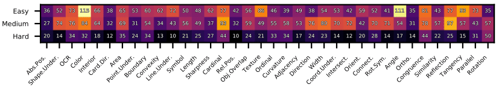
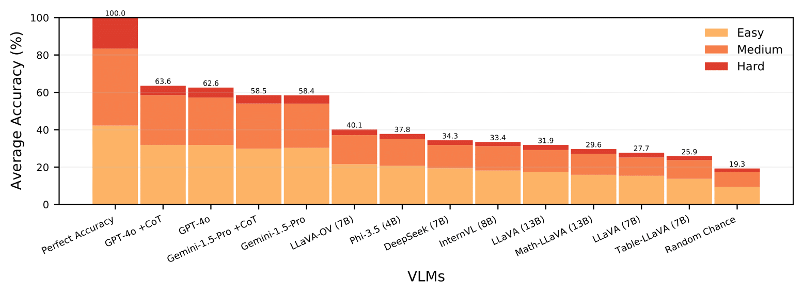
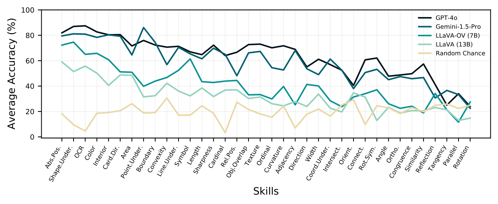
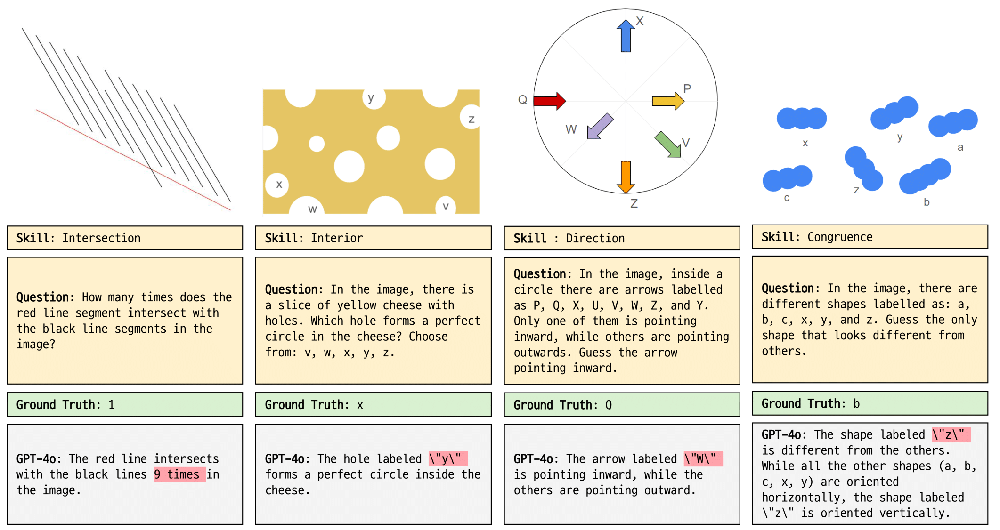

# Decomposing Complex Visual Comprehension into Atomic Visual Skills for Vision Language Models

 
 


[[Paper](https://openreview.net/forum?id=nFU4xCyoe0&referrer=%5BAuthor%20Console%5D(%2Fgroup%3Fid%3DNeurIPS.cc%2F2024%2FWorkshop%2FMATH-AI%2FAuthors%23your-submissions))]

## About AVSBench
Recent Vision Language Models (VLMs) have demonstrated impressive multimodal comprehension and reasoning capabilities, but they often struggle with trivially simple visual tasks. In this work, we introduce the **Atomic Visual Skills Benchmark (AVSBench)** to evaluate whether VLMs possess capabilities to *understand basic geometric features, which we refer to as atomic visual skills*. Specifically, we systematically categorize the atomic visual skills and handcraft a set of 5,073 diverse questions designed to assess each individual atomic visual skill. Using AVSBench, we evaluate the current leading VLMs and find that they struggle with most of these atomic visual skills that are obvious to humans.

## Dataset Overview
There are 6 atomic visual skills and the figure shows the number of easy, medium, and hard problems for each skill. The difficulty is judged by the authors. We provide a total of 5,073 new handcrafted problems.


## Evaluation Results



## Evaluation
**1. Download Repository**
```
git clone https://github.com/Atomic-Visual-Skills/AVS.git
cd AVS
pip install -r requirements.txt
```
Also, write down .env file with your api key.

**2. Download Dataset**

Download `images` directory and `test.json` to test models on the entire AVSBench dataset from [here](https://drive.google.com/drive/folders/1GRmasGPwu7pucbPvSHh6NA9xOn0w9Fti?usp=sharing). Then, locate them in `data/` directory. If you would like to test on best problems, you should also download `Best99.json`. You should unzip the downloaded `images`, locating all the subdirectories in `data/images/`.

```
# make sure the current directory is the local repository

mv {downloaded_files_path} data/
unzip data/images-20241214T153017Z-001.zip -d data/
```

**3. Get Model Responses**
```
sh scripts/run_model/gpt-4o.sh
```

**4. Extract Answers**
```
sh scripts/extract_answer/gpt-4o.sh
```

**5. Score Answers**
```
sh scripts/score_answer/gpt-4o.sh
```

**All at once (3 - 5)**
```
sh scripts/process/gpt-4o.sh
```

**Testing on only best 99 problems**

Replace the content of `scripts/run_model/gpt-4o.sh` to the following, then follow 3 - 5.

```
python evaluation/run_model.py \
--model gpt-4o \
--input data/Best99.json \
--output results/run_model/gpt-4o/gpt-4o.json

python evaluation/run_model.py \
--model gpt-4o \
--input data/Best99.json \
--output results/run_model/gpt-4o/gpt-4o-cot.json \
--cot
```


## Problem Examples


## Citation
```latex
@inproceedings{
    chae2024decomposing,
    title={Decomposing Complex Visual Comprehension into Atomic Visual Skills for Vision Language Models},
    author={Hyunsik Chae and Seungwoo Yoon and Chloe Yewon Chun and Gyehun Go and Yongin Cho and Gyeongmin Lee and Ernest K. Ryu},
    booktitle={The 4th Workshop on Mathematical Reasoning and AI at NeurIPS'24},
    year={2024},
    url={https://openreview.net/forum?id=nFU4xCyoe0}
}
```